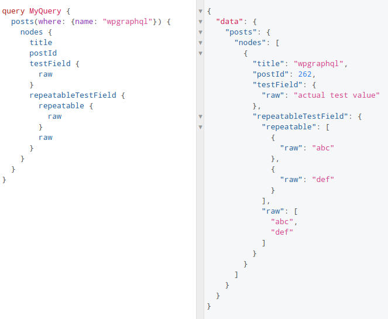

# [WPGraphQL](https://www.wpgraphql.com/) for Toolset, [Toolset](https://toolset.com/) for WPGraphQL

Expose Toolset's custom post types, taxonomies and post fields in WPGraphQL.

Just install this plugin together with Toolset Types and WPGraphQL and see for yourself.

## Installation

1. Download or clone the plugin files.
2. Run `composer install` from within the plugin directory.

## Usage

By default, the plugin exposes those Toolset custom posts and taxonomies that have the `show_in_rest` option set.
At the moment, this behaviour can be altered by using the `toolset_wpgraphql_show` filter. 

The structure of exposed fields is very similar to the [REST API integration done by Toolset](https://toolset.com/documentation/programmer-reference/toolset-integration-with-the-rest-api/#formatted-output-for-single-and-repeatable-fields).

## Future development

This is my personal project (at least for the time being) and it's **still in very early stages.** 

Possible next steps include:

- Making the current implementation more robust and adding test coverage.
- Toolset user and term fields.
- Toolset relationship data (relationships, associations, repeatable field groups).
- Allow access to field values using parameters like for the [types shortcode](https://toolset.com/documentation/customizing-sites-using-php/functions/).
- Venture into Views, WPAs, Content Templates, and so on.

_Contributions, feature request, issue reports and generally any sort of feedback is always very welcome.
The best way to get involved is direcly via GitHub._

Made with :heart: for [Toolset](http://toolset.com) and [OnTheGoSystems](http://onthegosystems.com).

